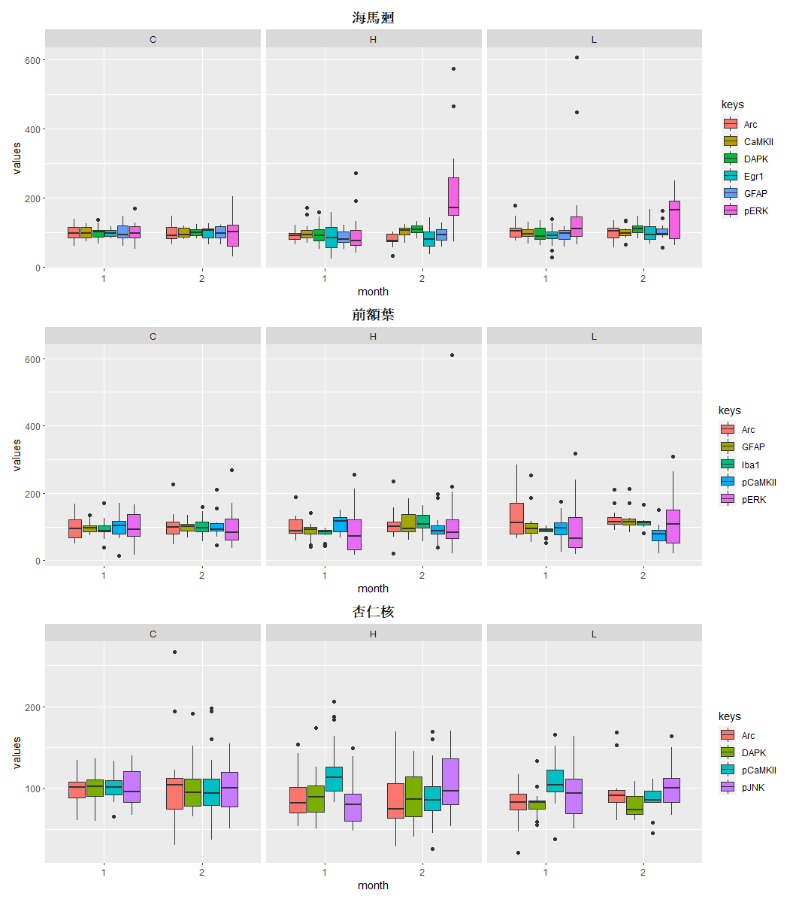
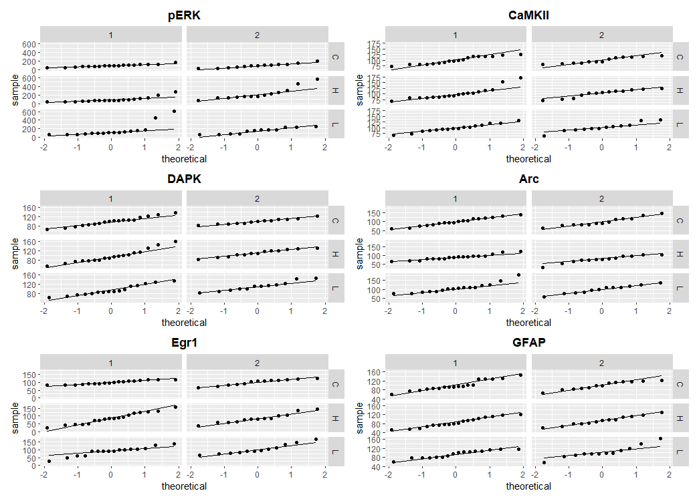

# DOE
## 生物實驗資料分析

* 資料概述  
清大生科系同學提供白鼠實驗資料 
透過塑膠微粒釋放的濃度不同 
紀錄白鼠腦中各類蛋白質變化 

* 資料概觀

| ID  | state | gender | month | pERK | ERK | pCaMKII | CaMKII  | pJNK | JNK | Arc | pp38 | DAPK | pDAPK | Egr1 | GFAP |
|-----|-------|--------|-------|------|-----|---------|---------|------|-----|-----|------|------|-------|------|------|
| C6  | C     | M      | 1     | 115  | 85  | 119     | 99      | 73   | 50  | 79  | 37   | 103  | 73    | NA   | 147  |
| C7  | C     | M      | 1     | 97   | 117 | NA      | 126     | 80   | 114 | 132 | 53   | 106  | 129   | 92   | 82   |
| C8  | C     | M      | 1     | 100  | 101 | 91      | 73      | 104  | 96  | 66  | 203  | 105  | 61    | 117  | 95   |
| C9  | C     | M      | 1     | 87   | 97  | 90      | 103     | 143  | 140 | 122 | 107  | 86   | 137   | 115  | 75   |
| C10 | C     | M      | 1     | 124  | 115 | 99      | 110     | 116  | 135 | 139 | 172  | 100  | 109   | 90   | 93   |
| C11 | C     | M      | 1     | 70   | 108 | 86      | 91      | 85   | 98  | 116 | 80   | 138  | 88    | 106  | 127  |
| C12 | C     | M      | 1     | 118  | 95  | 104     | 117     | 90   | 84  | 61  | 74   | 91   | 105   | 96   | 86   |
| C13 | C     | M      | 1     | 89   | 81  | 111     | 82      | 109  | 84  | 84  | 73   | 71   | 97    | 83   | 95   |
| L7  | L     | M      | 1     | 143  | 110 | 120     | 96      | 107  | 72  | 87  | 76   | 88   | 65    | 62   | 118  |
| L8  | L     | M      | 1     | 68   | 125 | 85      | 120     | 116  | 107 | 119 | 66   | 129  | 60    | 139  | 107  |

* feature 
 state(C:無塑膠微粒/L:低濃度塑膠微粒/H:高濃度塑膠微粒) 
 gender(Male/Female) 
 month

* label 
大腦中海馬迴、前額葉及杏仁核的各種蛋白質 
pERK / ERK / pCaMKII / CaMKII / pJNK / JNK / Arc / pp38 / DAPK / pDAPK / Egr1 / GFAP
 
### 任務
分析塑膠微粒濃度對蛋白質的影響 

(依據月份和塑膠微粒濃度將資料分成2x3=6組) 
| 餵食濃度 (state) | 餵食期間 (month) | group   |
|--------------|--------------|---------|
| C            | 1            | group 1 |
| H            | 1            | group 2 |
| L            | 1            | group 3 |
| C            | 2            | group 4 |
| H            | 2            | group 5 |
| L            | 2            | group 6 |

* step1 探索性資料分析 
**相關性** 

**常態性(Q-Q normal 以海馬迴中蛋白質為例)**

**常態性(Shapiro-Wilk test 以杏仁核區塊為例)** 
(p-value < 0.05 認定為較不服從常態分佈)

| group   | pJNK  | pCaMKII | DAPK  | Arc   |
|---------|-------|---------|-------|-------|
| group 1 | 0.215 | 0.991   | 0.948 | 0.63  |
| group 2 | 0.054 | 0.006   | 0.1   | 0.028 |
| group 3 | 0.41  | 0.427   | 0.033 | 0.412 |
| group 4 | 0.338 | 0.019   | 0.007 | 0     |
| group 5 | 0.067 | 0.26    | 0.514 | 0.607 |
| group 6 | 0.23  | 0.152   | 0.228 | 0.01  |

 (多數組別通過常態性檢定，適用ANOVA)
 
 * step2 統計分析 
   **two way ANOVA** 
 
   **事後檢定Tukey's range test**
 
 
 ### 結論
 
**1. 如果體內長期存有高濃度之塑膠微粒下，將導致海馬迴中神經細胞加速死亡，而最終對記憶及學習造成嚴重的危害**。 
**2. 長期含有高濃度之塑膠微粒下，並不會影響前額葉的認知功能。但可能也因樣本數量不夠，無法做出精準的判斷。** 
**3. 塑膠微粒的情況下並不會促進對杏仁核細胞死亡，所以我們並沒有發現對其造成損害的情況。**
 
 

